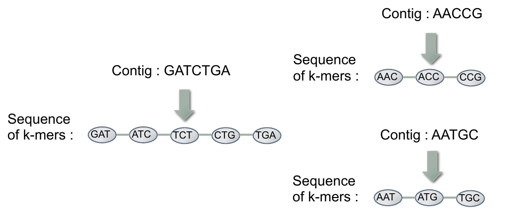
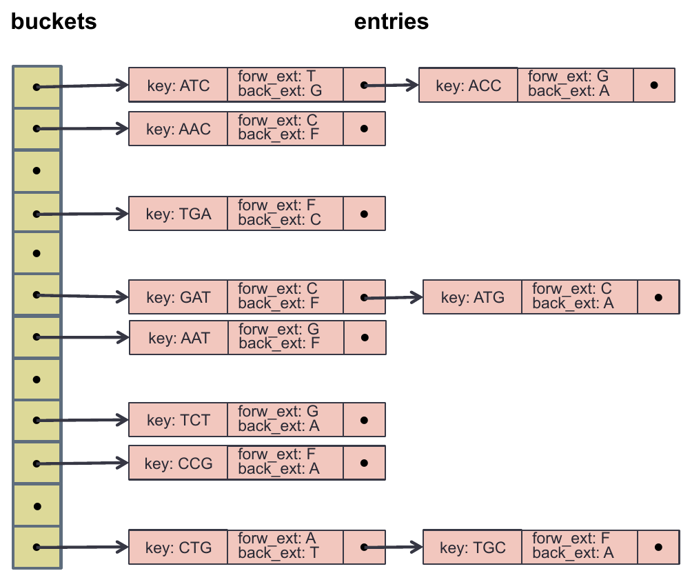

[Source](https://sites.google.com/a/lbl.gov/cs267-spring-2017/home/homework-3 "Permalink to Homework 3 - CS267 Spring 2017")

You can find different versions of this document in [HTML](https://cs267.github.io/hw3/), [PDF](https://cs267.github.io/hw3/index.pdf), or [GitHub](https://github.com/cs267/hw3).

# CS267 Assignment 3: Parallelize Graph Algorithms for de Novo Genome Assembly

**Due date (Berkeley students)**: We will release this assignment on bCourses shortly after the lecture on Partitioned Global Address Space programming in UPC, but do not panic, it will not be due until March 24th, 2017. Stay tuned for updates via Piazza CS267 Spring '17.

## Overview

Here is some background on de novo genome DNA assembly (though strictly speaking you don't need to know it to do this assignment). DNA assembly is the determination of the precise order of the nucleotides in a DNA molecule. A DNA molecule consists of four different bases, namely, adenine (A), guanine (G), cytosine (C), and thymine (T). For the purposes of this assignment we consider a DNA molecule to be a DNA strand, e.g. `CTAGGAGCT` (although in reality the number of bases for an actual DNA strand is much larger -- on the order of billions).

Unfortunately we can not read the whole DNA strand in one go and therefore researchers have come up with alternative methods. One such method is called *shotgun sequencing*. In this method, many copies of the original DNA strand are made. Each copy is then fragmented randomly into pieces. We cannot control how the copies are fragmented; they are randomly split into short contiguous fragments. Next, we read each small fragment and each result is called *"short read"*. Finally, we use all the short reads to reconstruct the original DNA strand. Figure 1 shows the process.

![Shotgun sequencing^[source: <http://people.mpi-inf.mpg.de/~sven/images/assembly.png>]](media/assembly.png){ style="zoom: 50%" width=40%}

Typically the short reads we get from shotgun sequencing are significantly shorter than the actual DNA strand they came from and this imposes a first challenge. A second challenge stems from the fact that the short reads include sequencing errors (with some error rate) and this makes the de novo genome assembly even harder. There are methods to preprocess the short reads and implicitly exclude the errors. These methods are outside of the scope of this homework assignment and we refer the interested reader to [@Chapman:2011kc].

The outcome of this preprocessing are *unique* sequence fragments of length k, henceforth called *k-mers*, that represent error-free DNA segments. Also, each k-mer is associated with a *forward* and a *backward extension*; these are the bases that should follow and precede the k-mer sequence in the actual DNA strand we want to reconstruct. Given a set of unique k-mers (i.e. each k-mer appears only once in the set), we can build a special graph which is a compact representation of the connectivity among these k-mers. This special type of graph is called *de Bruijn* and in general a de Bruijn graph is used to represent overlaps between sequences of symbols.

More specifically, in this de Bruijn graph of k-mers the vertices are the actual k-mers and two vertices are connected with an edge if the corresponding k-mers overlap in k-1 bases. Each vertex in the de Bruijn graph is guaranteed to have at most two neighbors. Additionally, each vertex in the de Bruijn graph is unique since the k-mers are unique. An example of such a de Bruijn graph is shown in Figure 2 where we illustrate a graph with k = 3. In this particular graph, nodes ATC and TCT are connected with an edge because they overlap in 2 bases (TC).

{ style="zoom: 50%" width=85%}

The contigs that are represented in this graph via connected components are: GATCTGA, AACCG and AATGC.

After building the de Bruijn graph, we can traverse it and find connected components that are called *contigs* -- which is an abbreviation of contiguous. Note that these connected components should be linear chains due to the nature of DNA. Contigs are *error-free* DNA sequences significantly longer than the original reads. Finally, the contigs are linked together by leveraging information of the original reads and eventually we get a set of *scaffolds* which constitute the final result of the de novo genome assembly. For this assignment, we will be focusing on the parallel construction and traversal of the de Bruijn graph of k-mers (with a few assumptions and simplifications) and we refer the interested reader to [@Chapman:2011kc] for more information on the scaffolding phase.

### Problem Statement

The **input** of the problem is a set of unique k-mers and their corresponding forward and backward extensions. There are also k-mers which correspond to *start nodes* in the de Bruijn graph: they indicate the start of a connected component. A start k-mer is flagged by having either its forward or its backward extension to be a "guard" extension F. In the example graph in Figure 2 the start node `GAT` has F as backward extension and the start node `TGA` has F as forward extension. Similarly, each connected component in the graph has two start nodes. The **answer** to the problem is a set of contigs that can be generated by traversing the de Bruijn graph and finding the connected components in it.

In this assignment we will be using a hash table [@wiki:hash] with separate chaining for collisions to store efficiently the underlying de Bruijn graph. In particular, a key in the hash table represents a node in the de Bruijn graph and its value is a two-letter code that implicitly stores its adjacent vertices (or equivalently the incident edges) efficiently. Figure 3 shows the de Bruijn graph of Figure 2 stored in a hash table. Note that each entry in the hash table includes a k-mer (key) and its corresponding forward and backward extensions.

{ style="zoom: 50%" width=80%}

Given a k-mer, we can concatenate its backward extension and the first k-1 bases of the k-mer and we get the preceding vertex (k-mer) in the graph. Similarly, if we concatenate the last k-1 bases of the k-mer and its forward extension we get the following vertex in the graph. For example, in the graph of Figure 2, node `TCT` is stored in the hash table with key `TCT` and its forward extension is G while the backward extension is A, meaning that `CTG` is the following vertex and `ATC` is the preceding vertex. Also, we emphasize that the de Bruijn graph is undirected and therefore we can visit a vertex both from the following node and from the preceding node.

### Serial Algorithm

Algorithm 1 illustrates the serial de Bruijn graph construction and traversal procedure. First, we store the input k-mers and their corresponding extensions in the hash table. If the backward extension of a k-mer is F, we append that k-mer in a `startNodesList` since we know that this is a start node in the de Bruijn graph and we can use this vertex as a traversal seed.

Algorithm 1: De Bruijn Graph Construction And Traversal

```lua
Input: A set of k-mers and their corresponding forward and backward extensions
Output: A set of contigs
/* Initialization */
hashTable<-CREATEHASHTABLE( )
startNodesList<-CREATEEMPTYLIST( )

/* De Bruijn Graph Construction */
for each (k-mer, forwardExt, backwardExt) in input do
    ADDKMERTOHASHTABLE(hashTable, (k-mer, forwardExt, backwardExt))
    if (backwardExt is F) then
        ADDKMERTOLIST(startNodesList, (k-mer, forwardExt))
    end if
end for

/* De Bruijn Graph Traversal */
for each (k-mer, forwardExt) in startNodesList do
    currentContig<-CREATENEWSEQUENCE(k-mer)
    currentForwardExtension<-forwardExt
    while (currentForwardExtension is not F) do
        ADDBASETOSEQUENCE(currentForwardExtension, currentContig)
        currentKmer<-LASTKBASES(currentContig)
        currentForwardExtension<-LOOKUP(hashTable, currentKmer)
    end while
    STORECONTIG(currentContig)
end for
```

After storing the input in the hash table, we iterate over the `startNodesList` and we pick traversal seeds. Given a traversal seed, we initialize a new contig sequence with that seed (k-mer) content. Then we expand the current contig sequence by iteratively adding one base at a time. Specifically, by taking the last k bases of the contig we form a new k-mer and we look it up in the hash table. As a result of this look up we get a new forward extension and we append it at the end of the current contig. We terminate the current traversal (and the current contig) when we encounter a forward extension that is *F* -- we know that we found the other start node of this connected component. The graph traversal is completed when all the connected components have been discovered or equivalently when all the start nodes from the `startNodesList` have been exhausted.

### Remote XSEDE/Moodle Students, Please Read

Dear Remote Students, we are thrilled to be a part of your parallel computing learning experience and to share these resources with you! To avoid confusion, please note that the assignment instructions, deadlines, and other assignment details posted here were designed for the local students. You should check with your local instruction team about submission, deadlines, job-running details, etc. and utilize Moodle for questions. With that in mind, the problem statement, source code, and references should still help you get started (just beware of institution-specific instructions). Best of luck and we hope you enjoy the assignment!

## Assignment

For this assignment you are asked to parallelize the de Bruijn graph construction and traversal algorithm by using the Unified Parallel C (UPC) programming language. You can assume that the number of connected components in the de Bruijn graph is orders of magnitude larger that the number of processors. We will examine the strong scaling efficiency of your code in two scenarios:

-   **Single node experiment**: In this experiment we will give you an input graph that fits in a single node's memory. Therefore you will be experimenting with 1, ..., 24 cores.
-   **Multiple nodes experiment**: In this experiment we will give you a quite large input graph and we will pretend that it does not fit in a single node's memory. Actually this is a typical case in real world's genomes (and metagenomes), where the underlying de Bruijn graph does not fit in a single node's memory. (The human genome consists of \~3 billion bases while the wheat genome consists of \~17 billion bases!) In this scenario you will be experimenting with 96, 120, 144, 168, 192 cores. Note: if we gave you a real graph that doesn't fit in a single node's memory you'd have to spend a lot of computational cycles. Your code should be generating the same set of contigs as the serial version we give you.

Feel free to output up to **p** files when running on **p** processors (you are welcome to output just one file as well). All your output file names must begin with `pgen` and end with `.out`.

### Source Code

`init.sh`

: an environment initialization bash script. Run `source init.sh` and then `make` to build the provided code out-of-the-box. You may modify `init.sh` to build your code in a different programming environment.

`serial.cpp`, `contig_generation.h`, `kmer_hash.h`, `packingDNAseq.h`

: a serial implementation that you need to efficiently parallelize

`pgen.upc`

:   a UPC code skeleton for you to start

`Makefile`

:   a Makefile for Edison

`job-serial`, `job-upc`

:   *sample* batch files to launch jobs on Edison. `job-upc` shows you how to check your output correctness with Unix's `sort` and `diff` tool. You may want to change the input path depending on where you store test or whether you want to use the large input (see below).

`job-scale-single-node`, `job-scale-multi-node`

:   *sample* batch files for single- and multiple-node strong scaling experiments. You may want to change the input path depending on where you store test or whether you want to use the large input (see below).

[`kmers.tar.gz`](https://sites.google.com/a/lbl.gov/cs267-spring-2017/kmers.tar.gz?attredirects=0&d=1)

:   all the above files in an archive

[`test.zip`](https://sites.google.com/a/lbl.gov/cs267-spring-2017/test.zip?attredirects=0&d=1)

:   a zipped test input file (small). Unzip before running...

You can find the **large input fileon Edison** at `/project/projectdirs/mp309/cs267/largeinput`.

**IMPORTANT**: The large input has 51-mers instead of 19-mers in the small test input file.

**You must change** the line `KMER_LENGTH = 19`in Makefile to `KMER_LENGTH = 51` and recompile your code before running it. (And vice versa if you want to run the small test input file again.)

Further, the large input file should be put in your `$SCRATCH `folder for faster input read. Also configure `$SCRATCH`'s striping parameter for even better read performance. (Even though it's only necessary for files larger than 1GB according to [NERSC's guide](https://www.nersc.gov/users/storage-and-file-systems/optimizing-io-performance-for-lustre/).) I.e. on top of using `$SCRATCH`, you might also want to use multiple OSTs to increase parallel I/O performance. In order to do so:

-   `cd $SCRATCH`
-   `mkdir my_stripped_folder`
-   `lfs setstripe my_stripped_folder -c 72 -s 8M`
-   copy the input data to the `my_stripped_folder`

You may want to play around with the -c and -s parameters. Also, for lower concurrencies striping might hurt performance. More information on this [link](https://www.nersc.gov/users/storage-and-file-systems/optimizing-io-performance-for-lustre/). You might check if there's any other filesystem that's faster than reading from your home folder, and the appropriate setting for it.

### Teams

You may work in groups of 2 or 3 (no more, no fewer). One person in your group should be a non-EECS student, but otherwise you are responsible for finding a group. The number of non-EECS students is a little less than half the total enrollment, so some teams may not have a non-EECS student. In that case, *one person in such team should be a non-CS student*. Once you have a group, add yourselves to a bCourses group (we have pre-created empty groups) by following [these instructions](https://guides.instructure.com/m/4212/l/64913-how-do-i-join-a-group-as-a-student). Have 1 person submit your assignment via your bCourses group, do not use the individual student submission function.

### Submission

Your submission should be a zip or tar file of a directory that contains your report, `Makefile`, and source code. Spell out in your report what `Makefile` target we are to build. We need to be able to build and execute your implementation in order for you to receive credit.

Here is the list of items you might show in your report:

-   A description of your distributed data structures and parallel algorithms
-   A description of the computational and "communication" motifs of the parallel algorithms.
-   A description of the design choices/optimizations that you tried and how did they affect the performance.
-   A description of how you avoided race conditions.
-   Speedup plots that show how closely your parallel code approaches the idealized p-times speedup in the two experimental scenarios described in the previous section.
-   Discussion of the scalability and relative costs of the parallel graph construction and traversal algorithms.
-   A discussion on using UPC for such an application with the underlying computational motif.
-   A discussion on how would you implement the same parallel algorithms in a two-sided communication model (e.g. by using MPI).

Your submission should be a single `name1_name2_name3_hw3.tar.gz` that, when unzipped, gives us a folder named `name1_name2_name3_hw3`. In this folder there should be the source files, a report file named `report.pdf`, a text file named `members.txt` containing your teammate's names, one line for each member, and a bash script named `init.sh` containing commmands to initialize your preferred programming environment.

Example:

```
Marquita_Jenny_hw3 (a folder)
  |--source files 
  |--Makefile with make target pgen
  |--report.pdf
  |--members.txt
  |--init.sh
```

Example `members.txt`:

```
Marquita Ellis
Jenny Huang
```

Example `init.sh` for Berkeley UPC (with GNU programming environment):

```bash
#!/bin/bash
module swap PrgEnv-intel PrgEnv-gnu
module load bupc
```

If, for some reason, you need to configure some environment variables, feel free to do so in your `init.sh`. Note that your scripts are subject to check.

### Bonus

-   Assume that the underlying de Bruijn graph consists of p connected components (p is the number of processors) whose length (number of vertices) follows a power law distribution. How well does your parallel code perform on this input? Can you do better (algorithmically)?

-   Assume that the underlying de Bruijn graph consists of a single connected component. How well does your parallel code perform on this input? Can you do better (algorithmically)?

## Resources

-   CS267 Spring 2017, Lecture 10: Partitioned Global Address Space Languages
-   CS267 Spring 2016, Lecture 8 - UPC ([pptx](http://www.cs.berkeley.edu/~demmel/cs267_Spr15/Lectures/lecture08-PGAS-yelick.pptx), [pdf](http://www.cs.berkeley.edu/~demmel/cs267_Spr15/Lectures/lecture08-PGAS-yelick.pdf))
-   [UPC Specification (v. 1.3)](http://upc.lbl.gov/publications/upc-spec-1.3.pdf), [Berkeley UPC Group](http://upc.lbl.gov/), [Berkeley UPC Documentation](http://upc.lbl.gov/docs/)
-   *Note, where the UPC Language Specification is ambiguous, check the implementation's documentation (for this assignment, refer to Berkeley UPC's documentation, there are other implementations out there that may allowably differ...)*
-   [UPC Quick Reference Card](http://upc.gwu.edu/downloads/quick_ref04.pdf)
-   [Berkeley UPC User's Guide](http://upc.lbl.gov/docs/user/)
-   [GASNet](http://gasnet.cs.berkeley.edu/) is a high-performance network layer that supports one-sided communication in UPC.
-   Other PGAS languages: [X10](http://x10-lang.org/), [Titanium](http://titanium.cs.berkeley.edu/), [Co-Array Fortran](http://en.wikipedia.org/wiki/Coarray_Fortran), [Chapel](http://chapel.cs.washington.edu/).

## References
